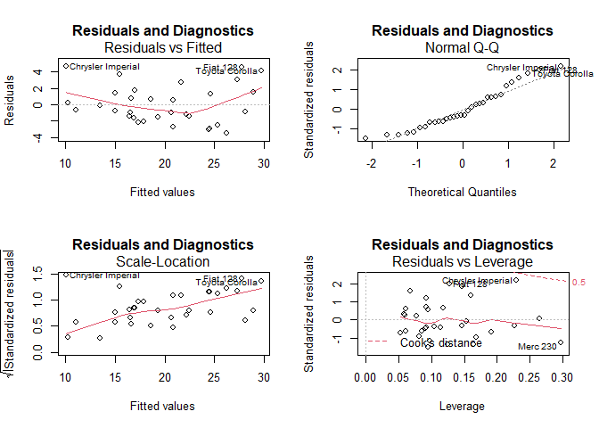
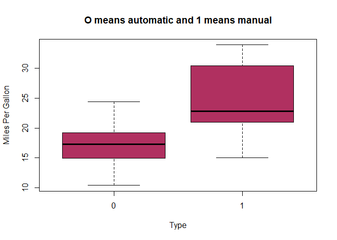

# Summary
You work for Motor Trend, a magazine about the automobile industry. Looking at a data set of a collection of cars, they are interested in exploring the relationship between a set of variables and miles per gallon (MPG) (outcome). They are particularly interested in the following two questions:

## 1. “Is an automatic or manual transmission better for MPG”
## 2. "Quantify the MPG difference between automatic and manual transmissions"
### Preprocessing the data

This is the preprocessing of data.


```r
setwd("D:/R/Class/6Inferential Statistics/Project")
library(datasets)
data(mtcars)
names(mtcars)
```

```
##  [1] "mpg"  "cyl"  "disp" "hp"   "drat" "wt"   "qsec" "vs"   "am"   "gear"
## [11] "carb"
```

```r
nrow(mtcars); ncol(mtcars)
```

```
## [1] 32
```

```
## [1] 11
```

```r
summary(mtcars)
```

```
##       mpg             cyl             disp             hp       
##  Min.   :10.40   Min.   :4.000   Min.   : 71.1   Min.   : 52.0  
##  1st Qu.:15.43   1st Qu.:4.000   1st Qu.:120.8   1st Qu.: 96.5  
##  Median :19.20   Median :6.000   Median :196.3   Median :123.0  
##  Mean   :20.09   Mean   :6.188   Mean   :230.7   Mean   :146.7  
##  3rd Qu.:22.80   3rd Qu.:8.000   3rd Qu.:326.0   3rd Qu.:180.0  
##  Max.   :33.90   Max.   :8.000   Max.   :472.0   Max.   :335.0  
##       drat             wt             qsec             vs        
##  Min.   :2.760   Min.   :1.513   Min.   :14.50   Min.   :0.0000  
##  1st Qu.:3.080   1st Qu.:2.581   1st Qu.:16.89   1st Qu.:0.0000  
##  Median :3.695   Median :3.325   Median :17.71   Median :0.0000  
##  Mean   :3.597   Mean   :3.217   Mean   :17.85   Mean   :0.4375  
##  3rd Qu.:3.920   3rd Qu.:3.610   3rd Qu.:18.90   3rd Qu.:1.0000  
##  Max.   :4.930   Max.   :5.424   Max.   :22.90   Max.   :1.0000  
##        am              gear            carb      
##  Min.   :0.0000   Min.   :3.000   Min.   :1.000  
##  1st Qu.:0.0000   1st Qu.:3.000   1st Qu.:2.000  
##  Median :0.0000   Median :4.000   Median :2.000  
##  Mean   :0.4062   Mean   :3.688   Mean   :2.812  
##  3rd Qu.:1.0000   3rd Qu.:4.000   3rd Qu.:4.000  
##  Max.   :1.0000   Max.   :5.000   Max.   :8.000
```

### Q1. Is an automatic or manual transmission better for MPG?


```r
t.test(mtcars$mpg~mtcars$am)$p.value
```

```
## [1] 0.001373638
```
Here, we checked the P-values which are less than 0.05. Thus, we can reject the NULL hypothesis. So we conclude that automatic cars have lower transmission than that of manual cars, when all other conditions remain ideally same.

### Q2. Quantify the MPG difference between automatic and manual transmissions.


```r
linreg <- lm(data=mtcars,mpg~.)
stp <- step(linreg,direction="both")
```

```
## Start:  AIC=70.9
## mpg ~ cyl + disp + hp + drat + wt + qsec + vs + am + gear + carb
## 
##        Df Sum of Sq    RSS    AIC
## - cyl   1    0.0799 147.57 68.915
## - vs    1    0.1601 147.66 68.932
## - carb  1    0.4067 147.90 68.986
## - gear  1    1.3531 148.85 69.190
## - drat  1    1.6270 149.12 69.249
## - disp  1    3.9167 151.41 69.736
## - hp    1    6.8399 154.33 70.348
## - qsec  1    8.8641 156.36 70.765
## <none>              147.49 70.898
## - am    1   10.5467 158.04 71.108
## - wt    1   27.0144 174.51 74.280
## 
## Step:  AIC=68.92
## mpg ~ disp + hp + drat + wt + qsec + vs + am + gear + carb
## 
##        Df Sum of Sq    RSS    AIC
## - vs    1    0.2685 147.84 66.973
## - carb  1    0.5201 148.09 67.028
## - gear  1    1.8211 149.40 67.308
## - drat  1    1.9826 149.56 67.342
## - disp  1    3.9009 151.47 67.750
## - hp    1    7.3632 154.94 68.473
## <none>              147.57 68.915
## - qsec  1   10.0933 157.67 69.032
## - am    1   11.8359 159.41 69.384
## + cyl   1    0.0799 147.49 70.898
## - wt    1   27.0280 174.60 72.297
## 
## Step:  AIC=66.97
## mpg ~ disp + hp + drat + wt + qsec + am + gear + carb
## 
##        Df Sum of Sq    RSS    AIC
## - carb  1    0.6855 148.53 65.121
## - gear  1    2.1437 149.99 65.434
## - drat  1    2.2139 150.06 65.449
## - disp  1    3.6467 151.49 65.753
## - hp    1    7.1060 154.95 66.475
## <none>              147.84 66.973
## - am    1   11.5694 159.41 67.384
## - qsec  1   15.6830 163.53 68.200
## + vs    1    0.2685 147.57 68.915
## + cyl   1    0.1883 147.66 68.932
## - wt    1   27.3799 175.22 70.410
## 
## Step:  AIC=65.12
## mpg ~ disp + hp + drat + wt + qsec + am + gear
## 
##        Df Sum of Sq    RSS    AIC
## - gear  1     1.565 150.09 63.457
## - drat  1     1.932 150.46 63.535
## <none>              148.53 65.121
## - disp  1    10.110 158.64 65.229
## - am    1    12.323 160.85 65.672
## - hp    1    14.826 163.35 66.166
## + carb  1     0.685 147.84 66.973
## + vs    1     0.434 148.09 67.028
## + cyl   1     0.414 148.11 67.032
## - qsec  1    26.408 174.94 68.358
## - wt    1    69.127 217.66 75.350
## 
## Step:  AIC=63.46
## mpg ~ disp + hp + drat + wt + qsec + am
## 
##        Df Sum of Sq    RSS    AIC
## - drat  1     3.345 153.44 62.162
## - disp  1     8.545 158.64 63.229
## <none>              150.09 63.457
## - hp    1    13.285 163.38 64.171
## + gear  1     1.565 148.53 65.121
## + cyl   1     1.003 149.09 65.242
## + vs    1     0.645 149.45 65.319
## + carb  1     0.107 149.99 65.434
## - am    1    20.036 170.13 65.466
## - qsec  1    25.574 175.67 66.491
## - wt    1    67.572 217.66 73.351
## 
## Step:  AIC=62.16
## mpg ~ disp + hp + wt + qsec + am
## 
##        Df Sum of Sq    RSS    AIC
## - disp  1     6.629 160.07 61.515
## <none>              153.44 62.162
## - hp    1    12.572 166.01 62.682
## + drat  1     3.345 150.09 63.457
## + gear  1     2.977 150.46 63.535
## + cyl   1     2.447 150.99 63.648
## + vs    1     1.121 152.32 63.927
## + carb  1     0.011 153.43 64.160
## - qsec  1    26.470 179.91 65.255
## - am    1    32.198 185.63 66.258
## - wt    1    69.043 222.48 72.051
## 
## Step:  AIC=61.52
## mpg ~ hp + wt + qsec + am
## 
##        Df Sum of Sq    RSS    AIC
## - hp    1     9.219 169.29 61.307
## <none>              160.07 61.515
## + disp  1     6.629 153.44 62.162
## + carb  1     3.227 156.84 62.864
## + drat  1     1.428 158.64 63.229
## - qsec  1    20.225 180.29 63.323
## + cyl   1     0.249 159.82 63.465
## + vs    1     0.249 159.82 63.466
## + gear  1     0.171 159.90 63.481
## - am    1    25.993 186.06 64.331
## - wt    1    78.494 238.56 72.284
## 
## Step:  AIC=61.31
## mpg ~ wt + qsec + am
## 
##        Df Sum of Sq    RSS    AIC
## <none>              169.29 61.307
## + hp    1     9.219 160.07 61.515
## + carb  1     8.036 161.25 61.751
## + disp  1     3.276 166.01 62.682
## + cyl   1     1.501 167.78 63.022
## + drat  1     1.400 167.89 63.042
## + gear  1     0.123 169.16 63.284
## + vs    1     0.000 169.29 63.307
## - am    1    26.178 195.46 63.908
## - qsec  1   109.034 278.32 75.217
## - wt    1   183.347 352.63 82.790
```

```r
summary(stp)
```

```
## 
## Call:
## lm(formula = mpg ~ wt + qsec + am, data = mtcars)
## 
## Residuals:
##     Min      1Q  Median      3Q     Max 
## -3.4811 -1.5555 -0.7257  1.4110  4.6610 
## 
## Coefficients:
##             Estimate Std. Error t value Pr(>|t|)    
## (Intercept)   9.6178     6.9596   1.382 0.177915    
## wt           -3.9165     0.7112  -5.507 6.95e-06 ***
## qsec          1.2259     0.2887   4.247 0.000216 ***
## am            2.9358     1.4109   2.081 0.046716 *  
## ---
## Signif. codes:  0 '***' 0.001 '**' 0.01 '*' 0.05 '.' 0.1 ' ' 1
## 
## Residual standard error: 2.459 on 28 degrees of freedom
## Multiple R-squared:  0.8497,	Adjusted R-squared:  0.8336 
## F-statistic: 52.75 on 3 and 28 DF,  p-value: 1.21e-11
```
#### Following are the conclusions drawn :
the model here has a 89.5% variance with adjusted variance of 0.879.
1. when the weight is increased by 1000lbs then mpg decreases by -3.176 for automatic transmission cars, and by -6.09 for manual transmission cars
2. so with increasing car weight we should choose manual transmission cars
3. when the acceleration speed dropped, and 1/4 mile time increased (by 1 sec), the mpg factor increased by 0.834 miles for automatic transmission cars, and 1.446 miles for manual transmission cars
4. so with lower acceleration speed, but same weight, manual transmission cars are better for mpg


## Appendix


```r
pairs(mtcars)
```

<!-- -->


```r
par(mfrow=c(2,2))
plot(stp,main="Residuals and Diagnostics")
```

<!-- -->


```r
boxplot(mtcars$mpg~mtcars$am,mtcars,xlab="Type",ylab="Miles Per Gallon",main="O means automatic and 1 means manual",col="maroon")
```

<!-- -->
